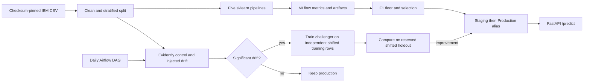

# Track A — Telco Churn MLOps

**Week 17 handoff:** [Detailed report and deliverable locations](docs/week17-submission-report.md) · [Task B README](https://github.com/shkroyas/Ai_Assistant_MLops#readme) · [Task B detailed report](https://github.com/shkroyas/Ai_Assistant_MLops/blob/main/docs/week17-submission-report.md)

Standalone W17 assignment by Royas Shakya. Built from scratch from the PDFs; no existing scaffold was reused. Track B is in a separate repository. Python 3.12, CPU only.

## Week 17 deliverables and required README sections

[Complete file inventory with SHA-256](docs/deliverable-manifest.tsv) · [Detailed implementation report](docs/week17-submission-report.md) · [Core evidence scorecard](reports/deliverables.md)

| Assessed section | Direct link |
|---|---|
| a. Environment and reproducibility | [uv setup](#a-environment--reproducibility-uv) |
| b. Experiment tracking and selection | [MLflow strategy](#b-experiment-tracking-strategy-mlflow) |
| c. Monitoring | [Evidently strategy](#c-monitoring--drift-strategy-evidently-ai) |
| d. Optional orchestration | [Airflow DAG](#d-orchestration-airflow-bonus) |

## Quick start

Run commands from this repository root:

```bash
uv sync --locked
uv run python scripts/run_pipeline.py
uv run pytest -q
uv run python scripts/check_deliverables.py
uv run uvicorn churn_mlops.serve:app --port 8001
```

The pipeline downloads the checksum-pinned IBM dataset, trains five models, promotes the best, generates six drift reports, and evaluates a challenger. Raw data, MLflow database, and serialized models are deliberately ignored by Git; a clean clone recreates them. Do not expect another machine to have the recorded run IDs until it reruns the pipeline. The submitted comparison and HTML evidence remain in reports/.

Individual stages:

```bash
uv run python scripts/download_data.py
uv run python -m churn_mlops.train
uv run python -m churn_mlops.registry promote
uv run python -m churn_mlops.drift
uv run python -m churn_mlops.registry challenge
uv run python -m churn_mlops.registry rollback --version 1
uv run mlflow server --backend-store-uri sqlite:///mlflow.db --host 127.0.0.1 --port 5001
```

The final command opens the local MLflow UI at http://localhost:5001. Use the run IDs in reports/model_comparison.md. Registry stages are intentionally retained under MLflow 2.22.2 to satisfy the assignment, alongside production/staging aliases. Stages are deprecated upstream; an upgrade would migrate serving to aliases while preserving transition evidence.

## a. Environment & Reproducibility (uv)

`uv sync --locked` recreates both application and dev dependencies. SQLAlchemy 2.1 removed an internal pool class used by the pinned MLflow release; an actual first run failed, so SQLAlchemy 2.0.41 is pinned. Evidently 0.7.23's Dataset/Report API and custom calculation class are tested directly. Track A uses Evidently without the LLM extra so CPU training does not install GPU runtimes. In containers, the project uses its own locked environment independently of Airflow. The dataset SHA-256 is in configs/data.sha256; downloads and cached bytes must match. Source: [IBM Telco sample](https://github.com/IBM/telco-customer-churn-on-icp4d/tree/master/data). The 7,043 rows include 11 blank TotalCharges values, imputed with the training median inside the sklearn pipeline. Splits are stratified 80/20 with seed 42; encoders and scaling never fit the holdout.

## b. Experiment Tracking Strategy (MLflow)

The experiment varies logistic-regression C (0.1/1.0) and random-forest depth (8/16/unlimited) and tree count (300/500), rather than varying only seeds. All five runs log accuracy, precision, recall, F1, ROC-AUC, model, confusion matrix, and ROC curve. These are the actual initial run results:

| name | accuracy | precision | recall | f1 | roc_auc | run_id |
|---|---|---|---|---|---|---|
| lr_c01 | 0.7999 | 0.6456 | 0.5455 | 0.5913 | 0.8409 | dab937c7a25f4034a0aba27d2dd64f1a |
| lr_c1 | 0.8055 | 0.6572 | 0.5588 | 0.6040 | 0.8419 | 8d101cc2c9714284a872d869e660a00f |
| rf_d8_n300 | 0.8055 | 0.6761 | 0.5134 | 0.5836 | 0.8417 | 6e766f252c7c4c4ba60f91ec19acc6f4 |
| rf_d16_n300 | 0.7793 | 0.6061 | 0.4813 | 0.5365 | 0.8268 | 7d825cc4618947a9bd400ded50676bbe |
| rf_dNone_n500 | 0.7771 | 0.6020 | 0.4733 | 0.5299 | 0.8189 | 9beb49d826a647d8b9907aa549028acc |

Initial winner **lr_c1** has F1 **0.6040**, ROC-AUC **0.8419**, and recall **0.5588**. The shallow forest ties accuracy at 0.8055 but has F1 0.5836 and recall 0.5134. Since churn is only about 26.5% of customers, choosing solely by accuracy would hide missed churn. Select the greatest F1, break ties by ROC-AUC, require F1 ≥0.55. This rule was declared in configs/params.yaml before training. The winner was registered as churn-classifier version 1 and transitioned None → Staging → Production. reports/registry.json records this original transition. Actual registry integration tests load the current production alias, exercise /predict, and reject invalid input with 422 (reports/api_demo.json).

The retraining experiment is separate from original selection. It fits a challenger on independently shifted training rows (seed 43) and evaluates both on the reserved holdout shifted with seed 44. This demonstration holdout is not used to fit the challenger. On this batch, champion F1 was **0.4109**, challenger F1 **0.6322**; ROC-AUC improved from **0.7915** to **0.7988**. The predeclared rule requires +0.005 F1 with no >0.01 ROC-AUC loss, so the challenger passed and was promoted. See reports/initial_challenge_result.json for the first successful challenge; reports/challenge_result.json records the latest scheduled comparison. During development a NumPy boolean serialization failure occurred after a version had been promoted; it was fixed, version 1 restored, and the challenge rerun successfully. Version numbers therefore include this development attempt; they are not model-quality scores. Later scheduled runs may retain the champion if the same challenger cannot improve it.

## c. Monitoring & Drift Strategy (Evidently AI)

Reference is a stratified 70% sample; current is the remaining 30%, independent of the predictive training split. Both a clean control and a synthetic drifted batch are evaluated. Contract == Month-to-month receives 5× sampling weight; MonthlyCharges receives Gaussian offsets (mean 35, SD 6 USD); 5% of labels are flipped in monitoring to demonstrate target drift. These are demonstration transformations, not a real production stream.

The control flagged **zero columns**. The synthetic batch flagged **MonthlyCharges and Contract**, plus tenure, DeviceProtection, TechSupport, StreamingTV, and TotalCharges. Those additional changes follow resampling correlated customers. Absolute mean MonthlyCharges shifted **34.4311 USD** (control: 0.6279), while churn rate moved from **0.2653 to 0.3928** (absolute shift 0.1275). Wasserstein numeric distance uses 0.15; categorical Jensen–Shannon distance uses 0.10. Feature flags come from Evidently's calculated ValueDrift values, not a second homemade detector. Target drift is an explicit ValueDrift report with Churn marked categorical. `MeanChargeShift` implements Evidently's native SingleValueMetric/SingleValueCalculation API and a <15 USD test. A separate absolute target-shift threshold of 0.05 prevents a default distribution test from hiding a material churn-rate change.

All six reports (control/drifted × data/target/custom) and their JSON snapshots are in reports/ and the churn-monitoring MLflow experiment. Significant drift requests challenger evaluation; it never justifies promotion by itself. A real service would distinguish logging changes, seasonal mix changes, and model degradation before using trustworthy newly labeled data for training.

## d. Orchestration (Airflow bonus)

`dags/churn_monitoring.py` schedules daily monitoring, branches to challenger evaluation on significant drift, or ends at no_retrain otherwise. The maximum active DAG run is one. The demo always monitors an injected batch, so the positive branch is reproducible. The challenger evaluation gates promotion. This is isolated in Dockerfile.airflow; it calls the project's venv with subprocess and cannot replace Airflow's dependencies. The DAG was executed successfully with `airflow dags test` in the pinned Airflow image. reports/airflow_run.txt captures check_drift → evaluate_challenger → done; no_retrain was skipped. The already-promoted champion and repeat challenger both scored F1 0.6322, so promotion was correctly rejected. This proves DAG execution, not a historical nightly scheduler run.

## Architecture



## Containers

```bash
docker compose up -d --build mlflow
docker compose --profile pipeline run --rm pipeline
docker compose up -d api
# Optional scheduler/UI; development standalone mode only.
docker compose --profile airflow up -d --build airflow
```

API: http://localhost:8001/docs by default; override CHURN_API_PORT in .env if occupied. MLflow: http://localhost:5001. Airflow: http://localhost:8081. Airflow's standalone admin password is generated on first start; retrieve it locally from the named airflow-data volume/container (do not commit it). Unpause churn_daily_monitoring in the UI. Restart the API after promotion because it deliberately loads one immutable version per process. No live hot-swap during an in-flight request.

## Verification and submission

`uv run ruff check src tests scripts dags`, `uv run ruff format --check src tests scripts dags`, and `uv run pytest -q`. CI validates locked setup and static implementation; full deliverables require the pipeline and live MLflow state. `scripts/check_deliverables.py` checks 20 implementation/runtime requirements, including actual MLflow artifacts. Airflow execution evidence is reported separately from that mandatory core scorecard. Run scripts from the root. reports/ contains measured evidence, not the plan's expected example numbers. The published repository has protected main, required passing CI and a [final release](https://github.com/shkroyas/w17-trackA-churn-mlops/releases/tag/w17-trackA-final). See the detailed handoff report for the assessed file map and evidence scope.

## Verified local services

The recorded Docker validation used http://localhost:18001/docs and MLflow http://localhost:5001. Task A containers were stopped at the 2026-10-04 handoff audit; start them with the commands above before using these URLs. The independent container pipeline completed; reports/container_validation preserves its run IDs separately. `uv run python scripts/smoke_api.py --base-url http://localhost:18001` records real prediction and invalid-input evidence in reports/deployment_smoke.json.


## Temporary Azure HTTPS demonstration

The separate Task A image adds an authenticated Nginx gateway, FastAPI and a small MLflow instance. Azure supplies HTTPS; Qwen inference uses the existing authenticated Jupyter HTTPS server proxy. The demo uses no SSH tunnel. See [deployment instructions, cost and cleanup](docs/azure-demo.md). Cloud availability must be established by the deployment smoke report; source files alone do not establish a running deployment.

Demo deployed on 2026-10-04: [Task A HTTPS gateway](https://task-a.calmflower-4280b7f7.centralindia.azurecontainerapps.io). Authentication uses the generated private `demo-access.json`; credentials are excluded from Git. Scheduled deletion: **2026-10-04 11:15 UTC / 17:00 Nepal**. [Deployment evidence](reports/cloud_demo/azure_deployment.json). Actual public prediction and invalid-input checks [passed](reports/cloud_demo/azure_https_smoke.json).

The [complete 9-minute-32-second demo video](https://github.com/shkroyas/w17-trackA-churn-mlops/releases/download/w17-trackA-final/week17-task-a-b-complete-demo.mp4) covers both separate tasks and actual Azure execution. [Transcript](https://github.com/shkroyas/w17-trackA-churn-mlops/releases/download/w17-trackA-final/COMPLETE_TRANSCRIPT.md) and [captions](https://github.com/shkroyas/w17-trackA-churn-mlops/releases/download/w17-trackA-final/week17-complete-demo.srt) accompany it. These combined assets require access to Task A's private repository.
